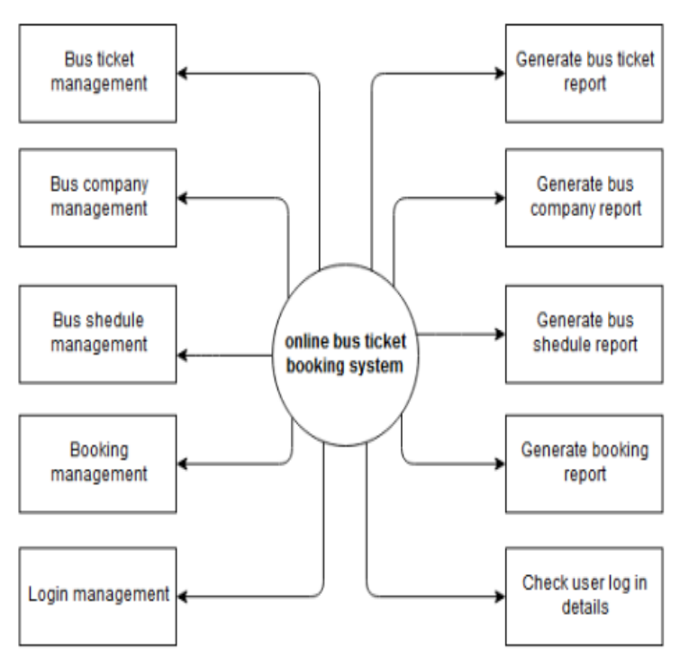
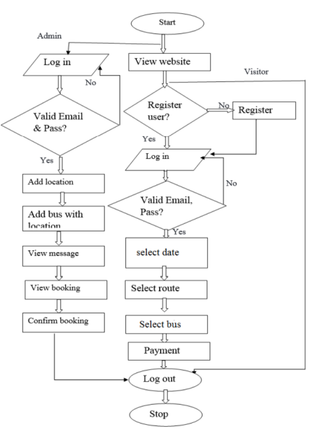

# Bus ticket Booking System Hosted in AWS Server
Bus reservation system 
deals with maintenance records of each passenger. It also includes maintenance of 
information like schedule and details of each bus. The working of the bus 
reservation system that there are many operations, which are to do manually. It 
takes a lot of time and causing many errors while data entry. Due to this, sometimes 
a lot of problems occur and facing many disputes with customers. To solve the 
above problem, and further maintaining records of passenger details, seat 
availability, price per seat, bill generation and other things, this is the proposal of 
computerized reservation system. By using the proposed system, people can reserve 
tickets from any part of the world via internet. Customer can check availability of 
bus and reserve selective seats. The project provides and checks all sorts of 
constraints so that user does give only useful data and thus validation is done in an 
effective way. The proposed bus reservation system was developed using Hypertext 
Markup Language (HTML), PHP Hypertext Preprocessor (PHP), Structure Query 
Language (SQL), Ajax, Cascading Style Sheet (CSS), and JavaScript. Keywords: 
Online bus ticketing system, electronic payment system web development, Online 
reservation system, Routes plan, Price and Seat plan.

## LIST OF MODULES:

1. Admin Module
2. Bookings and cancellation Module
3. Users Module

## Architecture

## Flow-chart

### Focus on
* Online bus ticketing system
* Electronic payment system web development
* Online reservation system
* Routes plan
* Price and Seat plan

